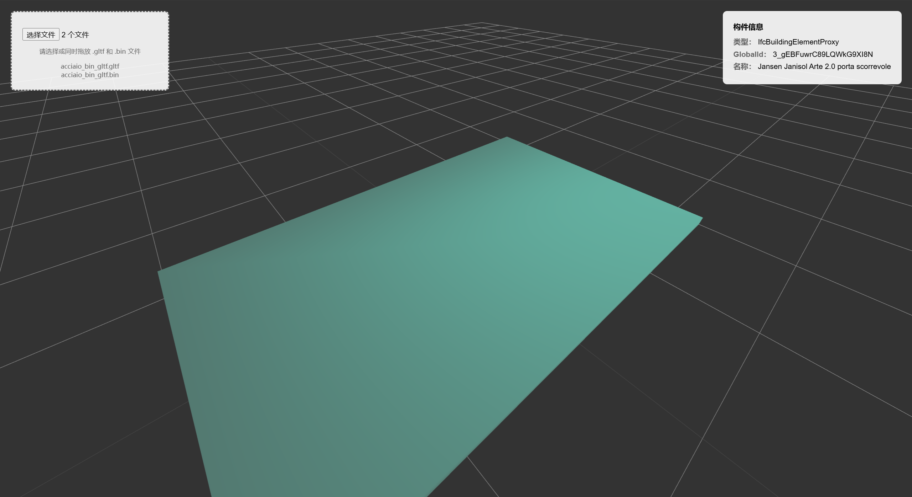
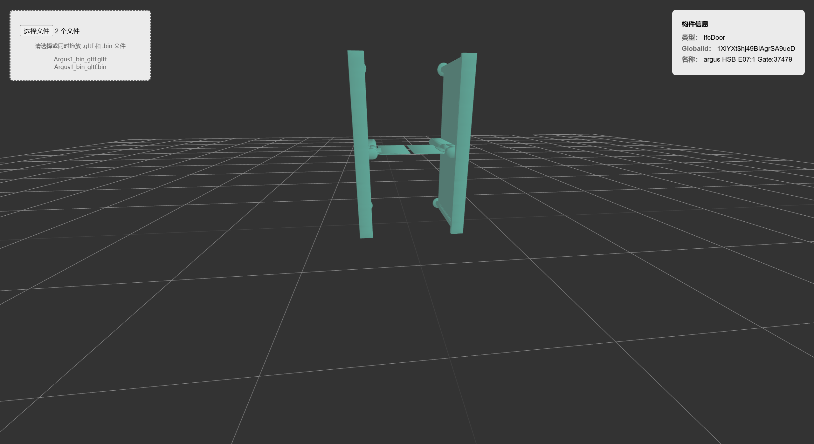
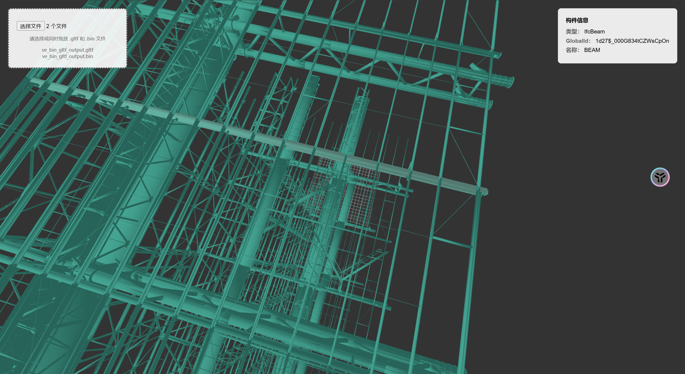

###### 程序说明：

这是一个将 IFC (Industry Foundation Classes) 文件转换为 glTF (GL Transmission Format) 格式的程序。

###### 主要功能

###### 文件格式转换：

将建筑信息模型(BIM)的IFC格式文件转换为用于3D图形的glTF格式

生成两个文件：.gltf（JSON格式的场景描述）和.bin（二进制几何数据）

###### 几何数据处理：

提取IFC模型中的3D几何数据（顶点、法线、面）

计算缺失的法线数据

优化和验证几何数据

###### 属性信息保存：

保留IFC模型中的重要属性信息，如：

构件的基本信息（名称、ID、类型等）

材质信息

几何属性（体积、面积、位置等）

结构属性

自定义属性集(Pset)中的信息

###### 材质处理：

创建和管理材质

基础PBR材质属性

支持材质扩展（KHR_materials_specular）


###### 安装conda环境

在conda环境中下载

下载对应操作系统的Anconda，然后将相应的配置设置在环境变量中

###### 创建环境：

```bash
conda create -n ifc_env python=3.9
```

###### 激活环境：

```bash
conda activate ifc_env
```

###### 在conda环境中下载pythonocc-core（读取几何图形的库）

```bash
conda install -c conda-forge pythonocc-core
```

建议下载ifcopenshell的zip解压缩手动放进环境中
包在当前目录下了：ifcopenshell-python-0.8.0-py39-win64.zip，解压缩以后命名为ifcopenshell
这个是window版的对应python3.9的
将整个 ifcopenshell 文件夹复制到您的 conda 环境的 site-packages 目录中
site-packages 目录通常在：C:\Users\您的用户名\.conda\envs\gltf\Lib\site-packages\

###### 使用pip install

```bash
pip install -r requirements.txt
```

###### 最后运行：

```bash
python ve_bin_gltf.py
```


###### 示例效果展示：

图一：



图二：



图三：



联系方式：

QQ邮箱：2923825940@qq.com

goole@gmail：yduan8650@gmail.com